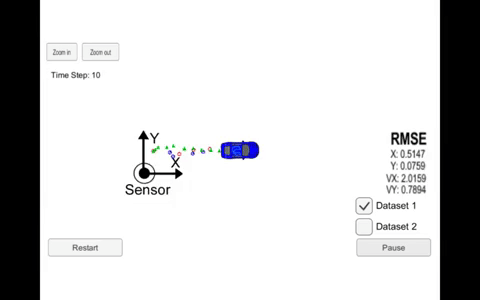
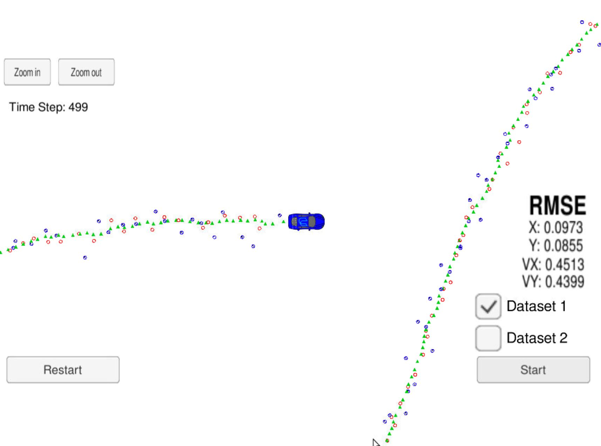
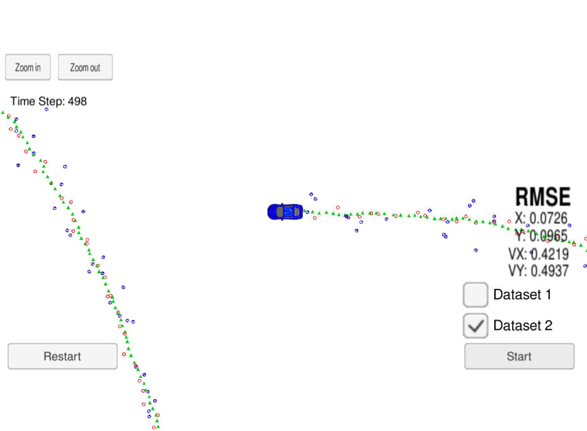

# Extended Kalman Filter Project

The goal of the project is to develope an Extended Kalman Filter using C++ in order  to estimate the state of a moving object (position and velocity).

The EKF uses the measurements provided by two different kind of sensors: Radar and Laser.

The overall performance of the Extended Kalman Filtered is evaluated in terms of Root Mean Square Error (RMSE) between the state estimate and the groundtruth data.

The code is tested on a simulator using two different datasets.

---

## Dependencies

* cmake >= 3.5
  * All OSes: [click here for installation instructions](https://cmake.org/install/)
* make >= 4.1 (Linux, Mac), 3.81 (Windows)
  * Linux: make is installed by default on most Linux distros
  * Mac: [install Xcode command line tools to get make](https://developer.apple.com/xcode/features/)
  * Windows: [Click here for installation instructions](http://gnuwin32.sourceforge.net/packages/make.htm)
* gcc/g++ >= 5.4
  * Linux: gcc / g++ is installed by default on most Linux distros
  * Mac: same deal as make - [install Xcode command line tools](https://developer.apple.com/xcode/features/)
  * Windows: recommend using [MinGW](http://www.mingw.org/)
* [simulator](https://github.com/udacity/self-driving-car-sim/releases/) 

## Build

1. Clone this repo.
2. Make a build directory: `mkdir build && cd build`
3. Compile: `cmake .. && make` 
   * On windows, you may need to run: `cmake .. -G "Unix Makefiles" && make`
4. Run it: `./ExtendedKF `

## Code structure
The [code  basic structure](https://github.com/udacity/CarND-Extended-Kalman-Filter-Project) is provided by udacity and contains the following files:

- `main.cpp`: reads in data, call the `EKF` and `RMSE` evaluation functions after each measurement.
- `FusionEKF.cpp`: initializes the filter, calls the `Predict` and `Update` functions
- `kalman_filter.cpp`: contains the `Predict` and `Update` functions, for both lidar and radar case.
- `tools.cpp`: contains the `RMSE` and `Jacobian` matrix evaluation functions.

The last three files have been coded in order to achieve the results.

---

## Results

The minimum specification for the succes of the project is that px, py, vx, and vy RMSE should be less than or equal to the values [.11, .11, 0.52, 0.52]. 

In our case, for Dataset 1, the RMSE corresponds to [.0973, .0855, .4513, .4399]

  

     

For Dataset 2, intead, the result is [.0726, .0965, .4219, .4937]

  

  
